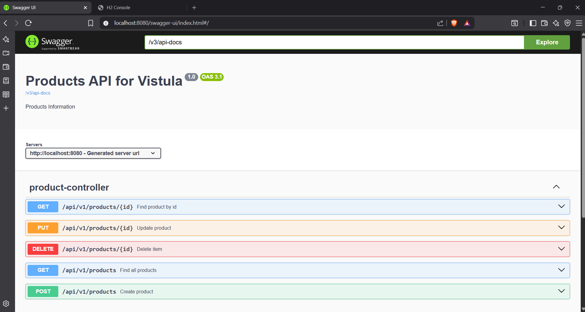

## FirstRestApiSpring — REST API with Spring Boot, JPA, H2 & Swagger

A simple but fully functional REST API built using Spring Boot, demonstrating clean architecture, layered design, DTO mapping, exception handling, and in‑memory database integration.  

## 📂 **Project Structure**

  Technologies Used

| Technology | Purpose |
|-----------|----------|
| Spring Boot | Application framework |
| Spring Web | REST API |
| Spring Data JPA | Database access |
| H2 Database | In‑memory DB |
| Swagger (springdoc-openapi) | API documentation |
| Lombok (optional) | Reduce boilerplate |
| Java 17+ | Language |

## How to Run the Project

1. Clone the repository
git clone https://github.com/<your-username>/FirstRestApiSpring.git
cd FirstRestApiSpring

2. Build & run**
Using Maven wrapper:
./mvnw spring-boot:run

Or from IntelliJ:  
Right‑click → Run 'FirstRestApiSpringApplication'

API Endpoints

Base URL
http://localhost:8080/api/v1/products
Endpoints Overview

| Method | Endpoint | Description |
|--------|----------|-------------|
| POST | `/` | Create a new product |
| GET | `/` | Get all products |
| GET | `/{id}` | Get product by ID |
| PUT | `/{id}` | Update product |
| DELETE | `/{id}` | Delete product |

## Example Requests

Create Product
json
POST /api/v1/products
{
  "name": "Laptop"
}

Update Product
json
PUT /api/v1/products/1
{
  "name": "Updated Laptop",
  "id": 1
}

Error Example
If product does not exist:
json
{
  "message": "Product with 99 not found"
}

## H2 Database Console

After running the app, open:
http://localhost:8080/console

Use this JDBC URL:
jdbc:h2:mem:testdb

Swagger Documentation

Swagger UI is available at:
http://localhost:8080/swagger-ui/index.html

OpenAPI JSON:
http://localhost:8080/v3/api-docs

## 🧱 Architecture Explanation

This project follows a clean, layered architecture:

Controller Layer (api)
Handles HTTP requests and responses.  
Uses DTOs (`ProductRequest`, `ProductResponse`).

Service Layer
Contains business logic.  
Uses `ProductExceptionSupplier` for clean exception creation.

Repository Layer
Uses Spring Data JPA to interact with the database.

Domain Layer
Contains the `Product` entity.

Support Layer
- `ProductMapper` converts between entity and DTO.
- `ProductExceptionAdvisor` handles errors globally.

---

## Testing the API

You can test using:

- **Swagger UI**
- **Postman**
- **cURL**
- **H2 Console**

📸 Screenshots

 1️⃣ Application Running
 [Spring Initializr](src/main/Screenshot/AppRunning.png)

2️⃣ Swagger UI - http://localhost:8080/swagger-ui/index.html

3️⃣ H2 database console - localhost:8080/console
[Database](src/main/Screenshot/H2-database.png)

4 Testing 
[Testing](src/main/Screenshot/Testing.png)

